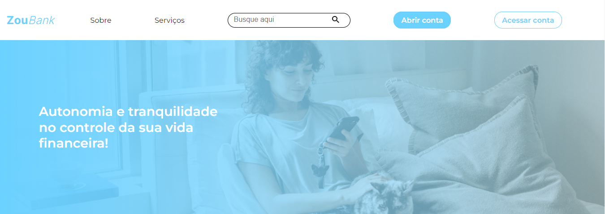
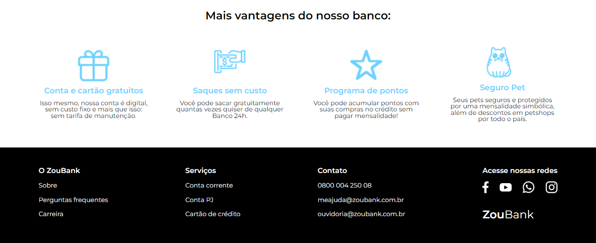
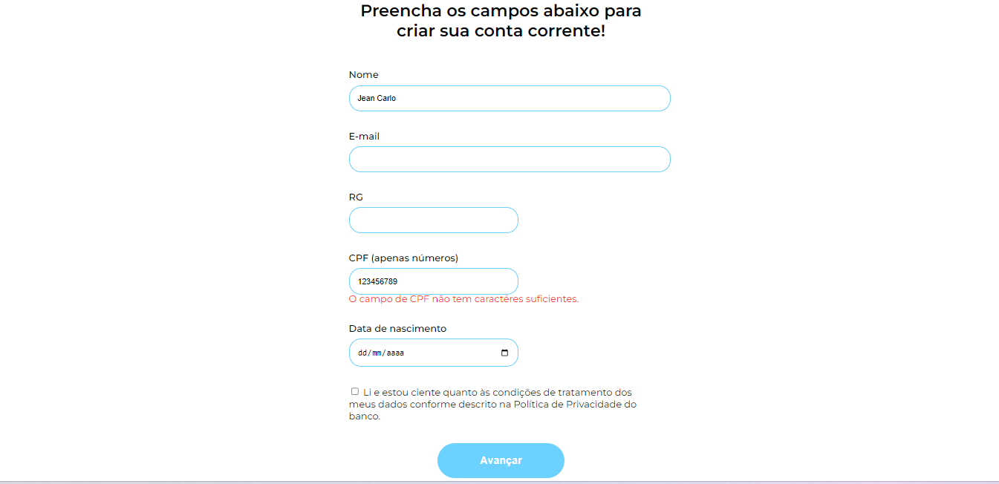
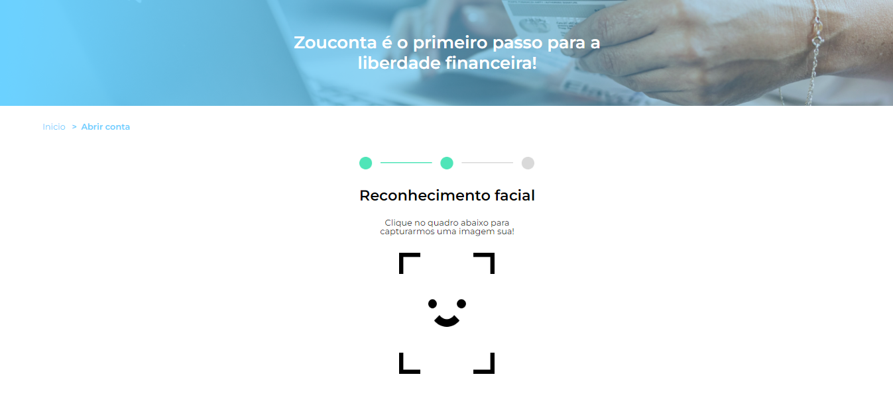
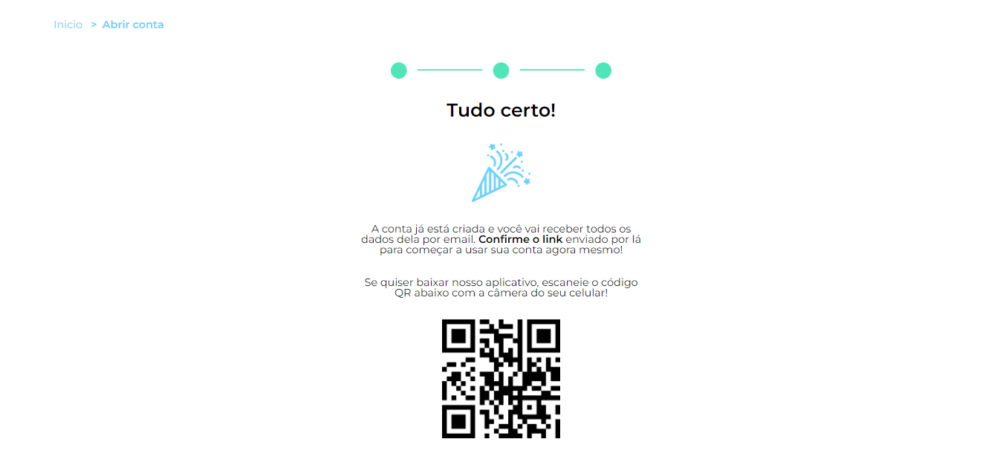
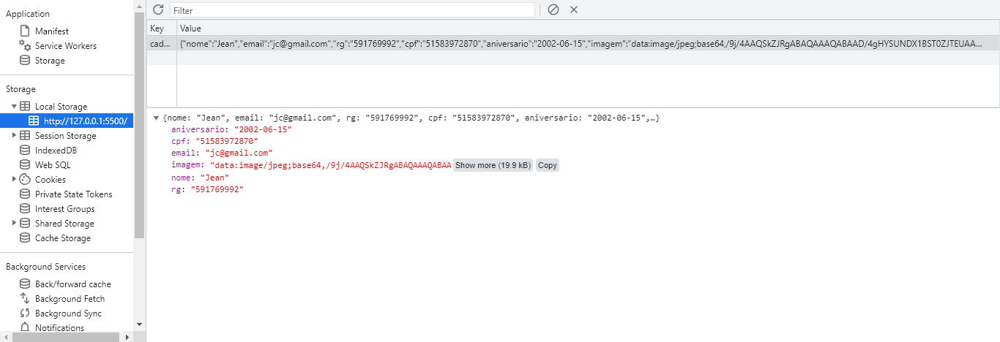

# ZouBank

Formulário de criação de contas para o banco virtual ZouBank.

 <h6 align="center"><a href="#">**Link para testar o projeto**</a></h6>

## Tecnologias utilizadas no projeto
* HTML
* CSS
* JavaScript

<h3>Contribuindo</h3>

⭐️ Star o projeto

🐛 Encontrar e relatar issues